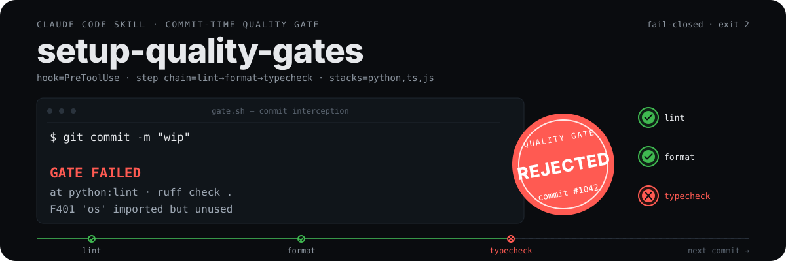
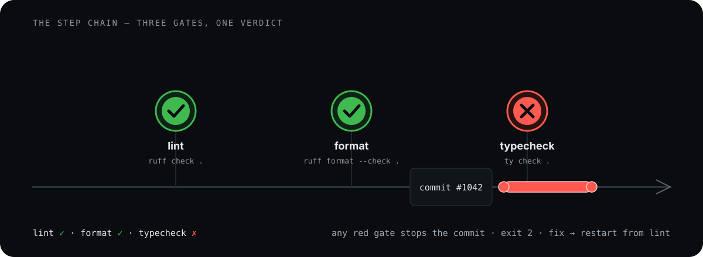

<p align="center">
  
</p>

# setup-quality-gates

A Claude Code skill that installs a commit-time quality gate into a target
project: a `PreToolUse` hook that blocks `git commit` unless **lint → format →
typecheck** all pass for the confirmed stack.

No CI setup, no config files to hand-write. Run one command, confirm your
stack, and every future commit is checked before it lands.

## How it works

<p align="center">
  
</p>

<p align="center">
  
</p>

- **A single hook.** The gate runs as a Claude Code `PreToolUse` hook on
  `.claude/hooks/gate.sh`. Non-commit commands pass straight through.
- **A three-stage step chain.** Every commit runs `lint → format → typecheck`
  for each confirmed stack. The first failing stage stops the chain and is
  reported to the agent as actionable feedback.
- **Fail-closed.** An invalid `settings.json`, a bad tool-map row, or a missing
  tool never silently disables the gate. Setup refuses to overwrite an invalid
  config and exits non-zero.
- **Gate loop, not a one-shot.** A blocked commit returns the failure to the
  agent to fix; the whole chain restarts from lint, so no state is carried
  between attempts.

## Why a gate, not a convention

The gate is versioned with your repo (a committed `.claude/` directory), so it
applies to every agent and maintainer working in the project — not just local
discipline. It runs at the moment of commit, in the same context as the
developer, so feedback lands where the fix happens.

## Install & first commit

<p align="center">
  
</p>

In the target project:

```bash
bash ~/.claude/skills/setup-quality-gates/setup.sh
```

Or drive it non-interactively:

```bash
bash ~/.claude/skills/setup-quality-gates/setup.sh \
  --target /path/to/project \
  --stack python,ts
```

Setup confirms the stack with you (it never auto-detects), installs missing
tools via `uv` (python) or `pnpm`/`npm` (ts/js), writes `.claude/settings.json`
plus the gate files, and self-verifies the written gate once:

```text
setup: installing quality gate into /path/to/project
  confirmed stack(s): python,ts

== Writing gate config ==
  copied .claude/hooks/gate.sh + .claude/hooks/gate_parse.py + .claude/hooks/tool_map.sh
  wrote /path/to/project/.claude/settings.json

== Self-verify ==
self-verify: OK — the quality gate chain is green for stack(s) [python,ts].

setup: done. Quality gate active for stack(s) [python,ts].
```

Commit the `.claude/` directory so the gate is versioned. From then on, every
`git commit` runs the chain.

## Stacks

| Stack | lint | format | typecheck |
| --- | --- | --- | --- |
| `python` | `ruff check .` | `ruff format --check .` | `ty check .` |
| `ts` | `biome lint .` | `biome format .` | `tsc --noEmit` |
| `js` | `biome lint .` | `biome format .` | — (no-op) |

Declare a comma-separated subset of these stacks at setup time, e.g.
`python,ts`. The stack list is passed to the gate through
`QUALITY_GATE_STACK` in the settings `env` block.

## What setup writes

- `.claude/settings.json` — the PreToolUse hook wiring and the
  `QUALITY_GATE_STACK` env. An existing settings.json is **merged, never
  clobbered**; the gate entry is replaced on re-run, and your other hooks and
  env variables survive.
- `.claude/hooks/gate.sh`, `gate_parse.py`, `tool_map.sh` — the hook, the
  commit detector, and the stack registry: the single source of stack names,
  stage commands, and install specs.

## Limitations

- GitHub Actions / CI gating is out of scope — this is a Claude Code hook.
- The stack is declared by you, never auto-detected, by design.
- Python is a setup dependency (it merges `settings.json` and parses the hook
  payload); the gated tools themselves are installed per stack.
